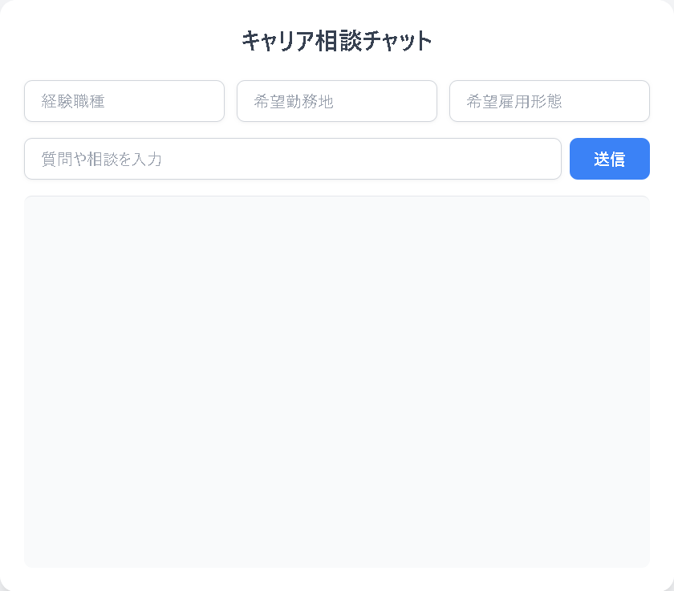

# キャリア相談チャット（デモ版）

Flask + OpenAI API を用いて構築したキャリア相談チャットアプリです。  
ポートフォリオ用のデモとして、Google スプレッドシートや CSV 保存などの外部連携部分はコメントアウトし、  
シンプルに **AI チャット機能** のみ動作する構成にしています。

🚀 デプロイ先（Render）：  
👉 https://ai-chat-45qv.onrender.com/
（※無料プランのため初回アクセス時に起動まで 1 分ほどかかる場合があります）

---

## 📌 機能概要
- OpenAI API（Chat Completions）を利用した会話型チャット
- Tailwind CSS によるシンプルでモダンな UI
- 初回入力フォーム（希望職種・勤務地・雇用形態）は残していますが、現在はダミー動作
- 履歴保存や Google Sheets 書き込み機能はコメントアウト済み（デモ用簡略化）

---

---

## 🎥 デモイメージ



---


## 🛠️ 使用技術
- **バックエンド**: Python 3, Flask
- **フロントエンド**: HTML, Tailwind CSS
- **AI**: OpenAI API (gpt-4o-mini)
- **デプロイ**: Render (Free Plan)

---

## 🚀 セットアップ方法（ローカル環境）

1. リポジトリをクローン
   ```bash
   git clone https://github.com/your-username/career-chat-demo.git
   cd career-chat-demo

2. 仮想環境を作成・有効化（推奨）
   python -m venv venv
   source venv/bin/activate   # Mac/Linux
   venv\Scripts\activate      # Windows

3. 必要パッケージをインストール
   pip install -r requirements.txt

4. .env ファイルを作成し、OpenAI API キーを設定
   OPENAI_API_KEY=your_openai_api_key

5. アプリを起動
   python app.py

6. ブラウザでアクセス
   http://127.0.0.1:5000/ 


名前: Ren Takasaki
GitHub: @suaren0117
ポートフォリオ:https://github.com/suaren0117